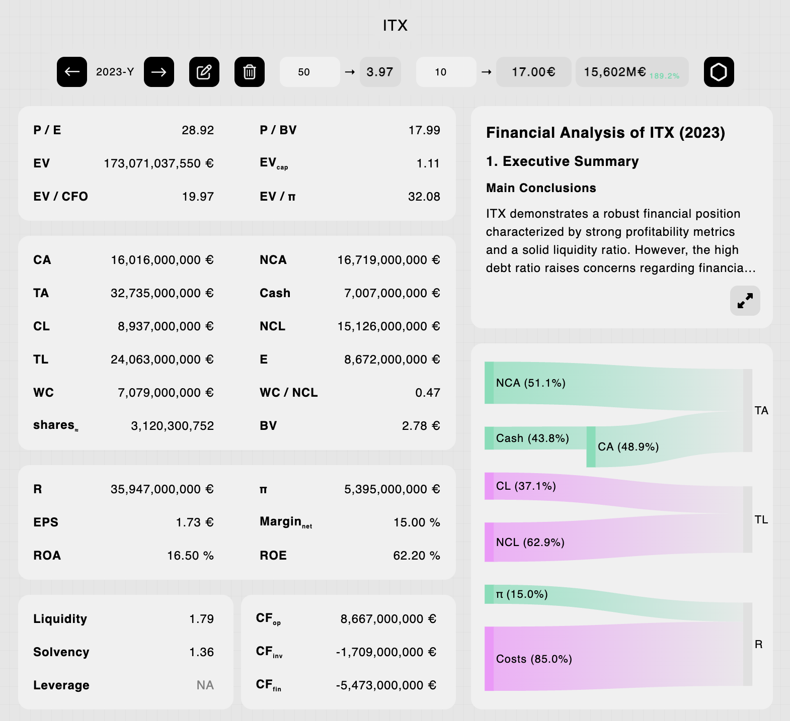

## nodo.finance

The core concept for
[genbraham/hermaeus](https://github.com/genbraham/hermaeus).

A production-ready side-project app that never made it to production (no time,
questionable PMF).

- Used AWS, Go, Vue, Javascript, D3, Terraform, Bash, Stripe, OpenAI.
- Full-stack monolith HTTP server on EC2, CI/CD with full redeployment or
  blue/green options, authentication, payments/paywall, serverless NoSQL,
  server/browser caches, responsive SPA...

---

  

---

**Inspired the open-source C CLI version:**

[genbraham/hermaeus](https://github.com/genbraham/hermaeus)
